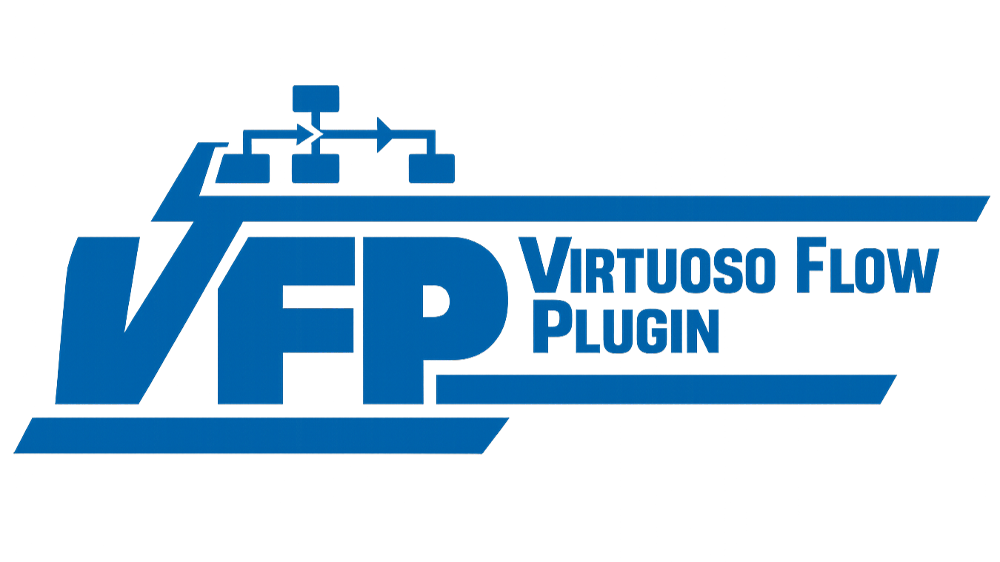

# Virtuoso Flow Plugin


<p align="center">
  
</p>

Virtuoso Flow Plugin is a **Cadence Virtuoso-native** workflow extension for analog
and mixed-signal IC design. It adds interactive panels, design-state
views, proposal review surfaces, and result dashboards directly inside
Cadence Virtuoso so designers can inspect, approve, and manage automated
design actions without leaving the Virtuoso environment.

The plugin works with **VFP Tunnel**, a local bridge daemon that connects
Virtuoso to AI agents, command-line tools, simulation runners, and
workflow automation scripts. Virtuoso Flow Plugin owns the in-tool UI,
schematic/ADE context, and designer approval flow; VFP Tunnel owns
agent communication, task scheduling, JSON-RPC transport, artifact
storage, session state, result parsing, constraint checks, and transaction
history.

The project goal is design-aware, auditable automation for analog IC
workflows. Agent-assisted changes are intended to be represented as
proposals, reviewed in Virtuoso, applied as transactions, linked to
simulation results, and rolled back when needed.

## Architecture

Two halves share the `schemas/` JSON contract: the **plugin** (in Virtuoso,
SKILL) owns design state and the netlist; the **tunnel** (stdlib Python daemon)
owns the agent interface, jobs, results, and history. Deck assembly for a
simulation is pluggable — the plugin in the live session (attended), a delegated
backend (our own channel, vcli, an OCEAN/direct-spectre command, or a custom
callable), or a VFP-managed headless Virtuoso — all writing to one convention
path the sim wrapper reads.


```text
 DRIVERS:  AI agent (MCP)  ·  CLI: scripts/vfp  ·  designer @ Virtuoso GUI
        │  JSON-RPC over TCP  (UTF-8 wire)
        ▼
┌──────────────────────────────────────────────────────────────────────────────┐
│ VFP TUNNEL — daemon (stdlib Python)            transport ─ dispatcher        │
│  session registry   proposal / transaction        SIM                        │
│   dedup / heartbeat   review → apply → rollback     job store + freshness    │
│   reap / doctor       connectivity audit            RUNNER: netlist step     │
│  context store        checkpoint · blame · batch            → sim step       │
│  constraint engine    netlist-request store         result store:            │
│  run / artifact store  event bus (log + long-poll)   metrics + provenance    │
│  envelope · ledger (M12)                             + metric_quality (0.2)  │
└────────────────┬─────────────────────────────────────────────────────────────┘
   ▲ skillrpc    │ event bridge (long-poll)
   │             ▼
┌───────────────────────────────────────────────────────────────────────────────┐
│ VFP PLUGIN — in Virtuoso (SKILL)                                              │
│  menu + dashboard · context export · sim preflight (dirty-check + fingerprint)│
│  proposal review · transaction apply/rollback · event client                  │
│  NETLIST ASSEMBLER:  vfpNetlistCellView ──► maeCreateNetlistForCorner         │
└───────────────────────────────────────────────────────────────────────────────┘

 DECK ASSEMBLY (a complete spectre deck) — pluggable backend:
   attended    the plugin in the user's LIVE Virtuoso session
   delegated   delegated_netlist.py ─► plugin (own channel) · vcli · command
                                       (OCEAN/direct-spectre) · module:callable
   VFP Daemon  a VFP-managed persistent `virtuoso -nograph` + plugin
        ▼  deck → \$VFP_NETLIST_DIR/<lib>__<cell>__<view>/netlist/input.scs
        ▼
 SIM WRAPPER (cellview_spectre_job.py): deck → SPECTRE → PSF
        ▼                              → metrics + provenance + metric_quality
 CADENCE: Virtuoso (Maestro/ADE) · Spectre · PDK    CONTRACT: schemas/
```

Full read-guide: [docs/architecture.md](docs/architecture.md).

## Current Status

Milestones 1–11 and 13a are implemented, plus the delegated netlist + VFP
Daemon and the transaction audit. The schematic closed loop is complete; the
**layout track** is underway (L1 context export, L2 geometry lint, and L3
layout↔schematic LVS-lite are done — see the [layout track](docs/HANDOFF.md)).

<div align="center">

| Milestone | Status |
| --- | --- |
| Virtuoso plugin skeleton: menu, dashboard, lib/cell/view | Done |
| VFP Tunnel: CLI, JSON-RPC, session state, SKILL bridge | Done |
| Design context export | Done |
| Proposal workflow | Done |
| Transactional parameter modification and rollback | Done |
| Result and constraint display | Done |
| ADE integration + run/artifact tracking | Done |
| Session identity: fingerprint dedup, heartbeat, reap, doctor (M8) | Done |
| Sim jobs: freshness guard, netlist dirty-check, real-spectre closed loop (M9) | Done |
| Cellview-specific real-spectre + attended netlist, result provenance (M10) | Done |
| Connectivity snapshot/diff, txn audit, auto-net risk, TB lint, blame chain (M11) | Parts 1–5 |
| Transport hardening: error taxonomy + UTF-8 audit (M13a) | Done |
| Delegated netlist + VFP Daemon: pluggable backend, netlist over own channel, managed headless Virtuoso | Done |
| Transaction audit: created_ts + actor / session / fingerprint at apply | Done |
| Layout context export (L1), geometry lint (L2), layout↔schematic LVS-lite (L3) | Done |
| Layout-edit transactions (L4a); generic layout-primitive mechanics (L5a: widen_net, move_instance) | Done (first increment) |

</div>

These milestones are covered by the Python test suite. The proposal
apply → rollback flow (with connectivity audit), the result/constraint
dashboard, tunnel-side proposal expiry, and the M8 session
fingerprint / heartbeat / reap path have also been verified live in
Virtuoso IC23.1. Pending proposals that are never acted on are aged out
to an `expired` status after a configurable TTL (default 5 minutes; set
`VFP_PROPOSAL_TTL_S`). Dead sessions can be aged out the same way via
`VFP_SESSION_TTL_S` (default `0` = disabled) or dropped on demand with
`scripts/vfp session reap`.


## Requirements

- Cadence Virtuoso, developed against the IC23.1 SKILL API.
- Python 3.6+ for VFP Tunnel runtime.
- Python 3.7+ if installing the tunnel as an editable Python package with
  modern setuptools.
- `pytest` and `jsonschema` for the Python test suite.

The tunnel runtime is stdlib-only, so the design server can run it with the
system Python 3.6 interpreter. `jsonschema` is optional and only enables
payload validation when present.

## Installation

Clone or copy this repository to a path visible from both Virtuoso and the
shell where the tunnel will run.

### No-install tunnel path

Use this path on the design server, especially when running under
CentOS 7 / Python 3.6:

```bash
scripts/vfp tunnel start
scripts/vfp tunnel status
scripts/vfp session list
scripts/vfp tunnel stop
```

The wrapper sets `PYTHONPATH` to the in-repo `tunnel/` package and pins the
system Python to avoid Cadence environment pollution. Override the
interpreter with `VFP_PYTHON` when needed.

### Editable development install

Use this path on a development machine:

```bash
cd tunnel
pip install -e .[dev]
vfp tunnel start
```

The default endpoint is `127.0.0.1:47891`. Override it with `VFP_HOST` and
`VFP_PORT`. The artifact/session root defaults to `./.vfp`; override it
with `VFP_HOME`. Pending proposals expire after `VFP_PROPOSAL_TTL_S`
seconds (default `300`; set `0` to disable expiry). Idle sessions are
auto-reaped after `VFP_SESSION_TTL_S` seconds (default `0` = disabled).

### Virtuoso plugin load

In the Virtuoso CIW, load the one-shot loader:

```lisp
load("/path/to/Virtuoso-Flow-Plugin/scripts/load_vfp.il")
```

Use forward slashes in SKILL paths, even on Windows. The loader resolves
the repository root relative to itself, loads `skill/vfp_init.il`, and
calls `vfpInit()`.

You can also load the entry point manually:

```lisp
load("/path/to/Virtuoso-Flow-Plugin/skill/vfp_init.il")
vfpInit()
```

## Basic Usage

Start the tunnel first:

```bash
scripts/vfp tunnel start
scripts/vfp tunnel status
```

Then load the plugin in Virtuoso:

```lisp
load("/path/to/Virtuoso-Flow-Plugin/scripts/load_vfp.il")
```

A **Virtuoso Flow** menu appears in the CIW and schematic windows. Choose
**Open Dashboard** to view:

- tunnel connection status
- current library, cell, and view
- ADE/result placeholders
- actions for Connect, Export, Refresh, Rollback, and proposal-related
  workflows

Open a schematic and click **Refresh** to update the library/cell/view
fields. With the tunnel running, click **Connect** to register the
Virtuoso session through the SKILL RPC bridge, then **Export** to send the
current schematic's instances, parameters, and connectivity to the tunnel
as a design context.

Useful SKILL entry points:

| Entry point | Effect |
| --- | --- |
| `vfpInit()` | Load modules, initialize state, and install the menu. |
| `vfpOpenDashboard()` | Open or raise the dashboard. |
| `vfpUpdateDashboard()` | Refresh dashboard fields from the current window. |
| `vfpConnect()` | Register the Virtuoso session with VFP Tunnel. |
| `vfpExportDesignContext()` | Send the current schematic context to the tunnel. |
| `vfpPing()` | Ping the registered tunnel session. |
| `vfpUnload()` | Remove menus and close the dashboard. |
| `vfpGetVersion()` | Return the plugin version string. |

Useful tunnel commands:

```bash
scripts/vfp tunnel start
scripts/vfp tunnel status
scripts/vfp ping
scripts/vfp session list
scripts/vfp session current
scripts/vfp session reap                       # drop idle (dead) sessions
scripts/vfp doctor                             # tunnel + session health
scripts/vfp daemon start          # VFP-managed headless Virtuoso (delegated netlist)
scripts/vfp daemon status
scripts/vfp daemon stop
scripts/vfp context show          # latest exported design context
scripts/vfp context import --file <ctx.json>   # load a context (testing)
scripts/vfp proposal list                      # design-change proposals
scripts/vfp proposal show <proposal_id>
scripts/vfp transaction list                   # applied/rolled-back changes
scripts/vfp result latest                      # latest simulation result
scripts/vfp constraint check --file <constraints.json>
scripts/vfp run list                           # ADE run / artifact tracking
scripts/vfp tunnel stop
```

## Verification

Run the Python tests from the repository root:

```bash
pytest tests/
```

Current verification (Milestones 1–8, 11, 13a):

- `pytest tests/`: 134 passing, 1 skipped on Windows Python 3.14;
  129 passing, 6 skipped on the design server's Python 3.6.8 (the skips
  need optional `jsonschema`). Run `pytest tests` — a bare `pytest`
  collects `gui_test/` and fails on import.
- Full CLI smoke test on Windows Python 3.14 and the design server
  Python 3.6.8.
- SKILL helper emits valid s-expressions for `tunnel.status`,
  `session.register`, `session.ping`, `design.context.update`,
  method-not-found errors, and unreachable-tunnel errors.
- Design-context encoder output conforms to `schemas/context.schema.json`;
  `vfp context import` / `vfp context show` round-trips a context through
  the daemon.

Manual GUI checks (verified live in Virtuoso IC23.1):

1. On the design server, run `scripts/vfp tunnel start`.
2. Reload the plugin in Virtuoso and open the dashboard.
3. Click **Connect** and confirm a connected session and tunnel summary.
4. Open a schematic, click **Export** (Export Context), and confirm the
   payload with `scripts/vfp context show`.
5. Apply an approved proposal and confirm the instance parameter changes
   on the schematic; **Rollback Last Transaction** restores it.
6. Import a result (`scripts/vfp result import ...`) and **Refresh** the
   dashboard to see the metrics and per-constraint pass/fail verdict.

## Repository Layout

```text
skill/      SKILL modules for the in-Virtuoso plugin
tunnel/     Python VFP Tunnel daemon, JSON-RPC transport, and CLI
schemas/    Shared JSON Schema contracts
examples/   Example design fixtures and proposal/context samples
scripts/    Loader and tunnel convenience wrappers
docs/       Development notes and usage docs
tests/      Python tests for VFP Tunnel and shared schemas
```

Both components live in one repository because the SKILL plugin and Python
tunnel share the same JSON-RPC and schema contract. Keeping them together
allows MVP contract changes to land atomically.

## Documentation

- [Handoff & roadmap](docs/HANDOFF.md) — start here to pick up the project
- [Architecture](docs/architecture.md) — the system at a glance (text diagram)
- [Plugin usage](docs/plugin_usage.md)
- [Development notes](docs/development_notes.md)
- [Tunnel README](tunnel/README.md)
- [Schemas](schemas/README.md)

## Thanks

[Virtuoso CLI](https://github.com/deanyou/virtuoso-cli): A full Rust
rewrite and major extension of VBL.

[Virtuoso-Bridge-Lite (VBL)](https://github.com/Arcadia-1/virtuoso-bridge-lite):
LLM agents drive Cadence Virtuoso instances.
